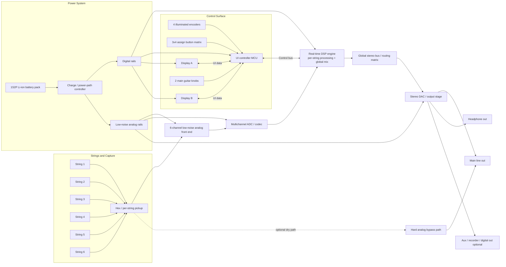

# Project Phantom — Block Diagram and Cavity Layout

This document defines the proposed electronic and mechanical integration for the **Project Phantom** architecture: a professional electric guitar with **per-string DSP**, a **physical control plate**, **two protected status displays**, and a **rear service cavity** housing the main processing and power system.

The goal is to preserve the identity of a real instrument while integrating advanced digital processing in a way that remains robust, serviceable, and stage-ready.

---

## 1. System Architecture Overview

Project Phantom should be treated as three coordinated systems:

1. **Instrument system** — neck, body, bridge, pickups, and direct guitar ergonomics  
2. **Audio system** — per-string capture, conversion, DSP, output, and fail-safe bypass  
3. **Control system** — physical control plate, displays, encoders, assign buttons, and UI logic  

This separation keeps the guitar playable, the DSP deterministic, and the UI modular.

---

## 2. Functional Block Diagram



---

## 3. Audio Signal Path

### 3.1 Per-string input stage
Each string should enter the system independently from the pickup onward.

**Recommended chain:**

- per-string pickup array
- short analog run to local preamp / protection stage
- multichannel conversion as early as practical
- DSP processing in the digital domain

### 3.2 Per-string DSP layer
Each string gets its own processing lane before entering the shared stereo or bus stage.

Typical per-string functions:

- gain trim
- high-pass / low-pass filtering
- compression
- saturation or distortion voicing
- pitch shifting for alternate tunings
- harmonization
- transient control
- per-string panning or stereo placement

### 3.3 Global mix layer
After per-string processing, all six lanes feed a global routing and output layer.

Typical global functions:

- amp / cabinet simulation
- master EQ
- global reverb / delay
- output limiting
- headphone voicing
- recording or DI routing

### 3.4 Fail-safe path
The guitar must remain usable if the DSP or UI subsystem fails.

Required fail-safe provisions:

- hard analog bypass to main output
- hardware mute / pop suppression on boot and shutdown
- fallback default preset or safe audio state
- power-loss behavior that does not produce output spikes

---

## 4. Control-Plane Architecture

The control plate should be implemented as a **dedicated UI daughterboard** mounted directly behind the front metal plate.

This board should contain:

- 4 illuminated encoders
- 2 small protected display modules
- 12 physical assign buttons in a 3×4 matrix
- LED driver circuitry
- a small UI controller MCU

This board should **not** carry the main audio conversion or main DSP circuitry.

### Why this split matters

It improves:

- serviceability
- sealing and moisture resistance
- mechanical reliability
- shielding discipline
- future UI revisions without touching the audio core

### Control bus
The UI board should communicate with the main processing board over a simple, robust control link, such as:

- SPI
- UART
- CAN or RS-485 if you want higher resilience
- I2C only for short local links, not long noisy harnesses

---

## 5. Physical Zoning of the Guitar

The body should be divided into three physical zones.

### Zone A — Instrument zone
Upper/front area reserved for guitar playing functions.

Includes:

- pickups
- bridge
- strings
- picking area
- two main guitar knobs

This zone must stay visually and ergonomically clean.

### Zone B — Front control plate zone
Lower-bout front plate reserved for the physical UI module.

Includes:

- metal or carbon-reinforced plate
- encoders
- two display windows
- assign-button matrix
- local UI electronics behind the plate

This zone is a **control surface**, not a general display panel.

### Zone C — Rear service cavity zone
Back-side cavity reserved for the main electronics and battery system.

Includes:

- DSP board
- conversion board
- power regulation
- battery pack
- shielding
- service access

This zone should be accessible via one primary rear hatch.

---

## 6. Front Layout — Recommended Arrangement

### Front view (conceptual, not to scale)

```text
 ┌──────────────────────────────────────────────────────────────┐
 │                         NECK / STRINGS                       │
 │                                                              │
 │      Pickup area / bridge / clean playing surface            │
 │                                                              │
 │                    [ Main Knob ] [ Main Knob ]               │
 │                                                              │
 │                               ╱────────────────────────╲     │
 │                              ╱   Phantom CONTROL PLATE       ╲    │
 │                             │  ○                         │    │
 │                             │  ○  ║      [Disp A][Disp B]│   │
 │                             │  ○  ║                       │   │
 │                             │  ○  ║      [ ][ ][ ]       │   │
 │                             │         ║    [ ][ ][ ]      │   │
 │                             │              [ ][ ][ ]      │   │
 │                             │              [ ][ ][ ]      │   │
 │                              ╲___________________________╱    │
 └──────────────────────────────────────────────────────────────┘
```

### Front control plate contents

Left column:
- four illuminated encoders

Center-left:
- two narrow parameter / EQ columns

Center:
- two recessed display windows

Right:
- 3×4 matrix of assign / navigation / scene buttons

### Front ergonomic rules

- the picking hand should not strike the plate during normal playing
- the top edge of the plate should be visually aligned with body contours
- the plate should be flush or very slightly recessed
- all sharp edges must be chamfered or radiused at touch points
- physical controls should remain operable without needing to stare at the body

---

## 7. Rear Cavity Layout — Recommended Arrangement

The rear cavity should be a **single main service hatch** with internal sub-zones.

### Rear view (conceptual)

```text
 ┌──────────────────────────────────────────────────────────────┐
 │                        REAR OF BODY                          │
 │                                                              │
 │                 ┌──────────────────────────┐                 │
 │                 │      Main Service Hatch  │                 │
 │                 │                          │                 │
 │                 │  [A] DSP / Codec board   │                 │
 │                 │                          │                 │
 │                 │  [B] Power regulation    │                 │
 │                 │                          │                 │
 │                 │  [C] Battery pack        │                 │
 │                 │                          │                 │
 │                 │  [D] Harness / shielding │                 │
 │                 └──────────────────────────┘                 │
 │                                                              │
 └──────────────────────────────────────────────────────────────┘
```

### Rear cavity sub-zones

**A. Main processing board area**
- DSP
- codec / ADC / DAC section
- system MCU if separate from DSP
- control-bus termination

**B. Power area**
- charge / power-path controller
- battery management and protection
- digital rail regulation
- analog low-noise regulation

**C. Battery area**
- 1S2P cell pack
- physical retention
- thermal isolation from audio path where possible

**D. Harness area**
- front plate interconnect
- pickup harness
- output jack harness
- service slack and strain relief

---

## 8. Cavity Priorities and Placement Rules

### 8.1 Keep analog short
The analog path from the per-string pickup to the front-end stage should be as short as practical.

### 8.2 Keep noisy digital away from pickup leads
The main processor, display buses, LED drivers, and switching regulators should not sit directly beneath the pickup zone if it can be avoided.

### 8.3 Separate analog and digital grounds deliberately
Use a planned grounding strategy rather than informal “everything on the same copper” routing.

### 8.4 Treat the control plate as a noisy zone
Because it contains LEDs, display lines, button scanning, and encoder signals, it should be considered a digitally active zone and isolated appropriately from the pickup path.

### 8.5 Make the rear hatch serviceable
The main electronics should be removable without disturbing the neck, bridge, or front plate.

---

## 9. Recommended Board Partitioning

### Board 1 — Pickup / analog front end board
Location: near pickup cavity or within the main cavity if lead lengths remain acceptable.

Functions:
- input protection
- buffering / gain staging
- anti-alias filtering if required
- routing to codec or ADC

### Board 2 — Main DSP / conversion board
Location: rear main cavity

Functions:
- multichannel ADC or codec
- real-time DSP
- stereo DAC or output codec section
- system communications
- preset storage

### Board 3 — UI daughterboard
Location: directly behind the front control plate

Functions:
- encoders
- button matrix
- display modules
- status LEDs
- local UI MCU

### Board 4 — Power board
Location: rear main cavity

Functions:
- charging
- power-path control
- battery protection
- analog and digital regulation
- startup / shutdown sequencing

This partitioning prevents one giant monolithic board from becoming mechanically or electrically unmanageable.

---

## 10. Suggested Harnessing

### Harness A — Pickup bundle
From per-string pickup to analog front end

Requirements:
- shielded where practical
- shortest route available
- strain relief near pickup cavity exit

### Harness B — UI interconnect
From rear main board to front control plate

Signals:
- low-voltage power
- display data
- button / encoder control bus
- LED power if required

Requirements:
- locking connector
- service loop
- routed away from sensitive analog lines

### Harness C — Output and charging interconnect
From main board to output jack and charging port

Requirements:
- mechanical reinforcement
- robust grounding
- isolated from pickup lines where possible

---

## 11. Thermal and Shielding Notes

### Thermal
The guitar should not feel warm in normal use.

That means:
- avoid oversized general-purpose computers in V1
- use efficient regulation
- keep heat-producing parts against areas that can dissipate safely
- do not trap battery and DSP in one unventilated thermal pocket without analysis

### Shielding
The guitar body remains wood, so shielding must be intentional.

Recommended measures:
- conductive cavity coating or copper foil in sensitive compartments
- shield can or local shielding over particularly noisy subsections
- conductive rear hatch plate where appropriate
- controlled connection between shield zones and chassis/ground strategy

---

## 12. Mechanical Character of the Front Plate

The front UI should be a **machined control plate**, not a display slab.

Recommended plate characteristics:

- black anodized aluminum or coated metal for early prototypes
- carbon fiber only if it does not compromise shielding or durability
- flush-mounted with gasketed perimeter
- recessed, protected windows for the two displays
- visible fasteners acceptable if they support the industrial language
- no glossy consumer-electronics bezel treatment

---

## 13. Recommended Interface Assignment

### Two main guitar knobs
Reserved for immediate performance functions:

- master volume
- wet/dry blend or tone

### Four plate encoders
Reserved for context-sensitive editing:

- parameter pages
- per-string edit pages
- effect mix or depth
- routing or macro control

### Twelve assign buttons
Reserved for live performance and navigation:

- preset recall
- scene switching
- effect block on/off
- menu navigation
- utility shortcuts

### Two small displays
Reserved for concise information only:

- preset / mode / selection context
- tuner / meter / string status / routing state

---

## 14. Prototype Sequence

### Phase 1 — Audio proof
Build the per-string signal path and prove:
- latency
- noise floor
- alternate tuning quality
- polyphonic stability

### Phase 2 — Control proof
Add the physical plate and prove:
- ergonomics
- readability
- workflow speed
- assign-button usefulness

### Phase 3 — Full body integration
Add:
- battery system
- charging port
- rear hatch mechanics
- sealing and shielding
- cosmetic finish

This sequence reduces risk and avoids overcommitting to industrial design before the audio engine is proven.

---

## 15. Summary

The exact architecture should be integrated like this:

- **per-string pickup and capture path** for six independent signals
- **early conversion into a real-time DSP engine**
- **global stereo routing after per-string processing**
- **physical control plate as a separate daughterboard**
- **single rear service cavity for brains, power, and battery**
- **hard analog bypass and pop-safe failover**
- **strict analog/digital separation and shielding discipline**

This gives Project Phantom the right balance of:

- instrument integrity
- serviceability
- low-latency DSP capability
- tactile stage usability
- premium industrial character

